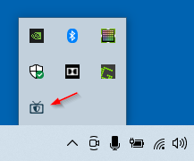

# Advanced Logo Analyzer Companion Desktop Tray Application

This is a lightweight Python app that runs in the system tray and provides a local server (on `localhost:64143`) for the browser extension to communicate with.

New! You can now alternatively install a version of this application that comes bundled with the Plugin Party Pack. Check that out [here](/companion-app-plugin-party-pack-combo) or stay on this page for just the Advanced Logo Analyzer.

## Features

- Detects edges of channel logos using computer vision
- Compares edges to determine presence of channel logo to determine commercial
- Runs entirely offline (no data ever leaves your computer)
- Designed to be used alongside the Live Commercial Blocker Chrome or Firefox extension

## Setup

### Option 1: Install from exe (Windows)

1. Download the exe from the [GitHub release](https://github.com/RG-O/YoutubeOverCommercials/releases/tag/advanced-logo-analyzer-release-v1.0)
2. Run the downloaded exe (note: you may need to click "More info" in the Windows popup to see the run option)
3. Follow the installation wizard
4. Run the application and it will appear in your system tray
5. Open the browser extension settings and set to "Logo Edge Mismatch" commercial detection mode

### Option 2 (Advanced): Run from Python

1. Install Python 3.13+
2. Clone this repo
3. Install dependencies from requirements.txt
4. Run advanced_logo_analyzer.py
5. Open the browser extension settings and set to "Logo Edge Mismatch" commercial detection mode

## Screenshots

Displays in system tray (idle while not in use):

User selects channel logo and then extension with the assistance of the companion application creates an edge mask for baseline:

Channel logo disapears so companion app tells extension that the current edges no longer match the mask of the logo, indicating commercial, so extension plays plays YouTube over top:

